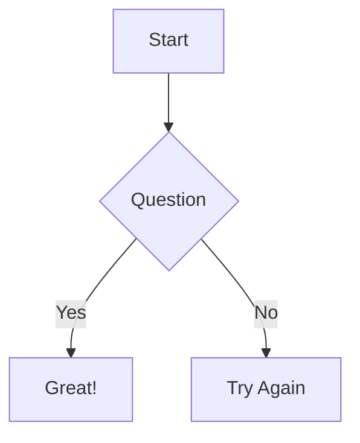

# Markdown Reader MVP

Flutter приложение для чтения Markdown файлов с поддержкой Mermaid диаграмм.

## 🚀 Возможности

- 📄 Чтение локальных Markdown файлов
- 📊 Рендеринг Mermaid диаграмм (flowcharts, sequence diagrams, class diagrams, etc.)
- 🌙 Автоматическая поддержка тёмной темы
- 🔤 Настройка размера шрифта
- 📱 Адаптивный дизайн
- 🎨 Material Design 3

## 📦 Установка

### Требования

- Flutter SDK 3.0+
- Dart SDK 3.0+
- Android SDK / iOS SDK / Web

### Установка зависимостей

```bash
flutter pub get
```

### Запуск

```bash
flutter run
```

## 🏗️ Архитектура

```
lib/
├── main.dart                    # Точка входа
└── app/
    ├── routes/
    │   └── app_pages.dart       # Маршрутизация (GetX)
    ├── controllers/
    │   ├── home_controller.dart      # Логика главного экрана
    │   └── markdown_viewer_controller.dart  # Логика просмотра Markdown
    ├── screens/
    │   ├── home_screen.dart          # Главный экран
    │   └── markdown_viewer_screen.dart  # Экран просмотра
    ├── theme/
    │   └── app_theme.dart      # Темы приложения
    └── utils/
        └── markdown_parser.dart # Утилиты парсинга
```

## 📚 Зависимости

| Пакет | Версия | Назначение |
|-------|--------|------------|
| flutter_markdown | ^0.6.18 | Рендеринг Markdown |
| webview_flutter | ^4.4.0 | Mermaid.js для диаграмм |
| file_picker | ^8.0.0 | Выбор файлов |
| get | ^4.6.6 | State management |
| path_provider | ^2.1.1 | Доступ к путям |

## 🖼️ Скриншоты

### Главный экран
- Выбор Markdown файла с устройства
- Просмотр примеров файлов

### Экран просмотра
- Рендеринг Markdown с форматированием
- Отображение Mermaid диаграмм
- Настройка размера шрифта

## 📝 Использование

### Открыть файл

1. Нажмите "Open Markdown File"
2. Выберите файл с расширением `.md`, `.markdown` или `.txt`
3. Файл будет отображён с поддержкой всех диаграмм

### Примеры диаграмм



## 🔧 Настройка

### Темы

Темы настраиваются в `lib/app/theme/app_theme.dart`:

```dart
static final lightTheme = ThemeData(
  colorScheme: ColorScheme.fromSeed(seedColor: primaryColor),
  useMaterial3: true,
  // ...
);
```

### Mermaid

Конфигурация Mermaid находится в `lib/app/screens/markdown_viewer_screen.dart`:

```javascript
mermaid.initialize({
  startOnLoad: true,
  theme: 'default',
  securityLevel: 'loose',
});
```

## 🧪 Тестирование

```bash
flutter test
```

## 📱 Платформы

- ✅ Android (minSdk 21)
- ✅ iOS
- ✅ Web
- ✅ macOS
- ✅ Windows
- ✅ Linux

## 📄 Лицензия

MIT License

## 🤝 Вклад

Приветствуются Pull Requests!
