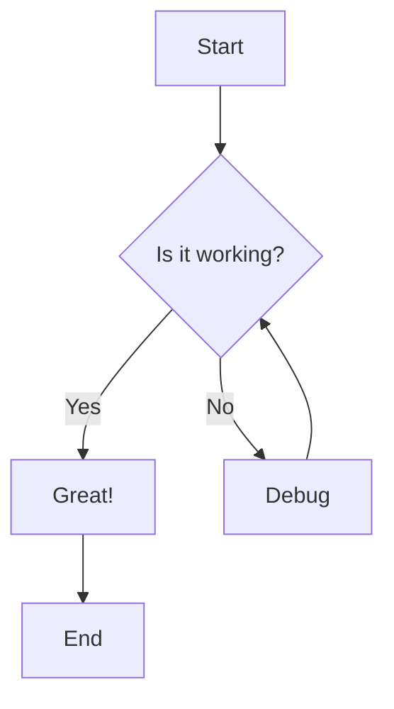
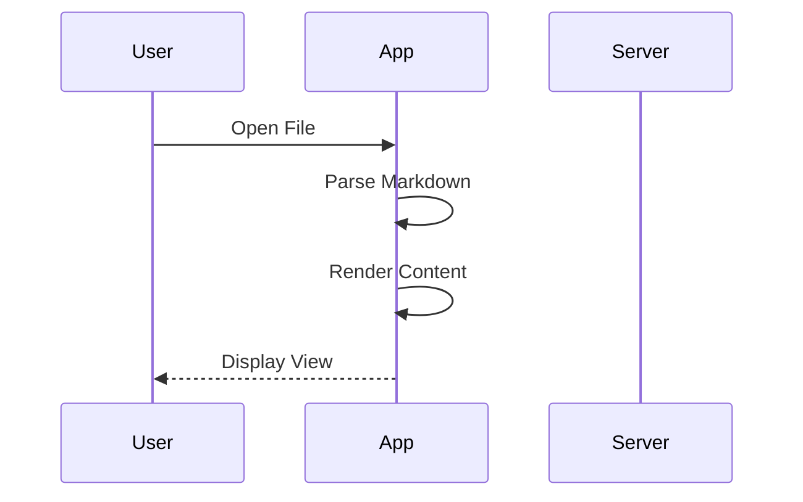
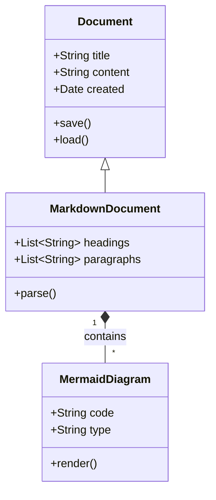
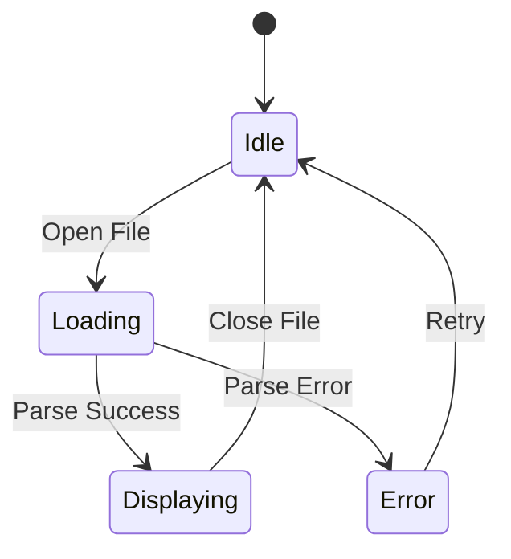
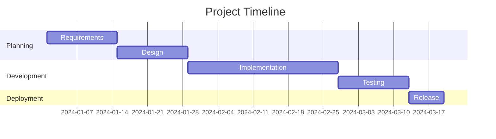
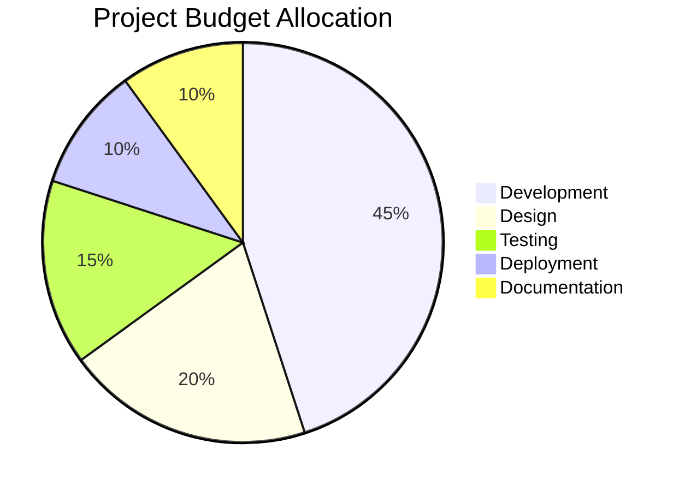
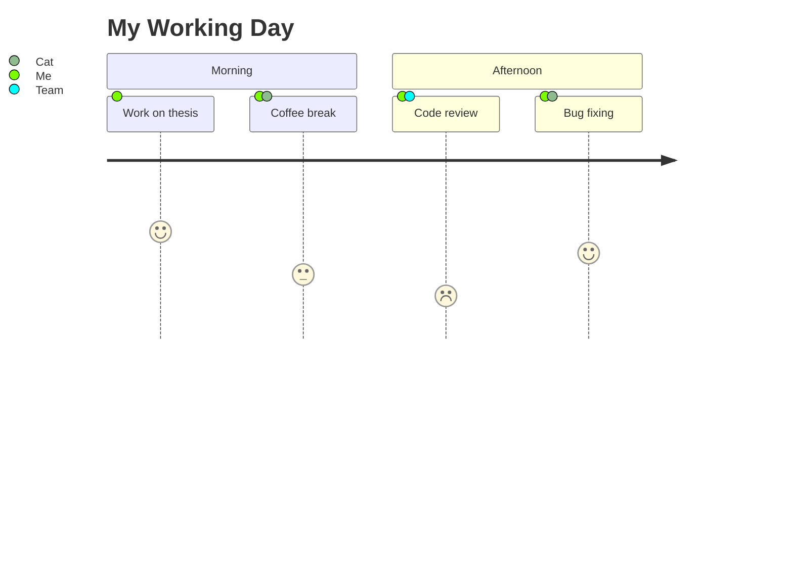

# Welcome to Markdown Reader MVP

This is a sample Markdown file demonstrating the capabilities of our Flutter Markdown Reader with **Mermaid diagram support**.

## Features

- **Markdown Rendering**: Full support for standard Markdown syntax
- **Mermaid Diagrams**: Beautiful flowcharts, sequence diagrams, and more
- **File Selection**: Open local Markdown files from your device
- **Dark Mode**: Automatic theme support based on system settings
- **Adjustable Font Size**: Customize your reading experience

---

## Text Formatting

You can use various text formatting options:

- **Bold text** using double asterisks
- *Italic text* using single asterisks
- `Inline code` using backticks
- ~~Strikethrough~~ using double tildes

## Lists

### Unordered List
- Item one
- Item two
  - Nested item
  - Another nested item
- Item three

### Ordered List
1. First item
2. Second item
3. Third item

## Code Blocks

```dart
void main() {
  print('Hello, World!');
}
```

```python
def greet(name):
    return f"Hello, {name}!"
```

## Blockquote

> "The only way to do great work is to love what you do." - Steve Jobs

---

## Mermaid Diagrams

### Flowchart



### Sequence Diagram



### Class Diagram



### State Diagram



### Gantt Chart



### Pie Chart



### User Journey



---

## Tables

| Feature | Status | Priority |
|---------|--------|----------|
| Markdown Render | ✅ Done | High |
| Mermaid Support | ✅ Done | High |
| File Picker | ✅ Done | Medium |
| Dark Mode | ✅ Done | Medium |
| Font Size | ✅ Done | Low |

---

## Links

- [Flutter Official Website](https://flutter.dev)
- [Mermaid Documentation](https://mermaid.js.org)
- [Markdown Guide](https://www.markdownguide.org)

---

## Conclusion

This Markdown Reader MVP demonstrates how to build a Flutter application that can render Markdown files with embedded Mermaid diagrams. The implementation uses `webview_flutter` to leverage Mermaid.js for diagram rendering while providing a native-like experience.

**Happy reading! 📚**
